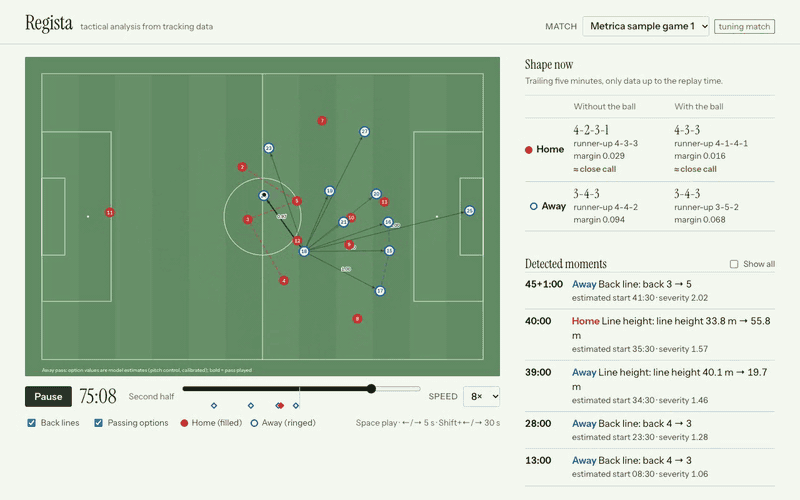

# Regista

Football match intelligence: from match video to tactical insight a coach can
ask questions about.

> **Status:** Phases 1 and 2 complete: tactical analytics on open tracking data,
> and a local analyst agent that answers questions and flags tactical changes.
> Video perception (Phase 3) does not exist yet. Every number below is generated
> by `eval/phase1.py` or `eval/agent/run.py`.

## What it does

From open tracking data (Phase 1):

- Converts Metrica and SkillCorner tracking data into one canonical format.
- Infers possession and passes from tracking alone.
- Detects formations and roles per team, in and out of possession.
- Measures team shape (line height, length, width, compactness) and builds pass
  networks.
- Scores passing options with a pitch-control model, calibrated on held-out data.

On top of that (Phase 2):

- Flags tactical moments as they happen (back-line, pressing, and line-height
  changes) with causal detectors that only use data up to each moment.
- Answers questions about a match with a local model (Ollama) calling Regista's
  tools over MCP, citing the time ranges each answer comes from; every number is
  checked against the tool outputs before an answer is marked verified.
- Replays the match in a browser viewer with formations, detected moments, and
  answers whose citations seek the replay.

Planned: tracking from match video (Phase 3). See [`docs/ROADMAP.md`](docs/ROADMAP.md).

## Architecture

```
match video ─▶ perception ─▶ pitch mapping ─┐           (planned, Phase 3)
                                            ├─▶ canonical frames ─▶ tactical analytics ─▶ match store ─▶ MCP tools ─▶ analyst agent
open tracking data ─▶ ingest adapters ──────┘                                                         └─▶ viewer
```

Every source, whether open data today or CV output later, is converted to one
canonical schema (`src/regista/schema.py`). The analytics layer never knows
where its data came from.

## Results (Phase 1)

<!-- results:start -->
<!-- Generated by eval/phase1.py from eval/reports/phase1_results.json. Do not edit by hand. -->

| Result (Metrica game 3 held out unless noted) | Value |
|---|---|
| Label error in game 3's event file: two players swapped in the second half | pass-detection F1 0.809 with published labels, 0.914 corrected (210 events re-attributed) |
| Pitch control vs logistic baseline, Brier skill vs base rate, labelled pass attempts | raw 0.384, Platt-calibrated 0.461, logistic 0.187 (n = 1253) |
| Roles vs SkillCorner listed positions (20 matches) | sides 0.819 vs 0.685 for a width-thirds baseline; position groups 0.731 vs 0.724 for a depth-rank baseline, a tie (difference +0.007, 95% CI -0.006 to +0.020) |
| Home pass network, inferred from tracking vs labelled events (Pearson) | 0.810 with published labels, 0.981 corrected |


Full report with methods, confidence intervals, and limitations: [`eval/reports/phase1.md`](eval/reports/phase1.md). Design decisions: [`docs/DESIGN.md`](docs/DESIGN.md). Reproduce every number with `uv run python eval/phase1.py`.
<!-- results:end -->

## Results (Phase 2: analyst agent)

<!-- phase2:start -->
<!-- Generated by eval/agent/run.py --report from eval/reports/phase2_results.json. Do not edit by hand. -->

Frozen agent: `qwen3.5:9b` via Ollama (local, no paid API), tested once on held-out matches after freezing on Metrica games 1-2. Headline: SkillCorner, 20 matches, 1175 questions; 95% intervals resample matches.

| Question type | Accuracy (95% CI) |
|---|---|
| Lookup (formation, line height, top pass pair), n = 100 | 1.000 |
| Comparison (which team pressed more, held a higher line), n = 54 | 1.000 |
| When (first detected change), n = 31 | 1.000 |
| Multi-step (top passer and completion), n = 39 | 0.949 (0.87-1.00) |
| Reworded questions (answerable), n = 570 | 0.951 (0.94-0.96) |
| Low-confidence formations flagged as close calls, n = 60 | 0.983 (0.95-1.00) |
| Unanswerable (xG, player names, score): declined, n = 100 | 1.000 |
| False premise rejected with evidence, n = 161 | 0.665 (0.62-0.71) |
| **All SkillCorner questions** | **0.928** |

Every number and match time in an answer is checked against the tool outputs (0.973 of answers passed); citations point at recorded frames and cover the time asked about (0.995); median answer time 10.7 s on a laptop. Metrica game 3 (57 questions) scored 1.000: one match, so no interval, and 8 of its golds came from a moment list missing one late first-half moment (a v1.0 bug, fixed in v1.1; see the report).

What the automatic scores miss:

- A deterministic audit found 9 of 21 match summaries calling the higher defensive line "deeper"; the LLM judge (`gemma4:12b`) rated most of them 5/5 for faithfulness.
- Against 18 hand labels, the false-premise judge agreed 0.89 (kappa 0.68; 0.89 after a rubric review). The summary judge averaged 5.0/5 for faithfulness where the hand labels averaged 4.3 (3.2 after review).
- Tactical-moment detectors flag a median 10 moments per held-out match (range 2-17; 4 above the 12-per-match reading budget). There is no ground truth for tactical moments.

Full report with every category, per-template results, judge-human agreement, and known issues: [`eval/reports/phase2_agent.md`](eval/reports/phase2_agent.md); detected moments: [`eval/reports/phase2_moments.md`](eval/reports/phase2_moments.md). The demo runs agent v1.1, which fixes four bugs found after the test run ([ADR-009](docs/DESIGN.md#agent-v11-post-test-bug-fixes)); the numbers above are for the evaluated v1.0.
<!-- phase2:end -->

## Quick start

```bash
git clone https://github.com/Pranav1011/regista && cd regista
uv sync --group dev
uv run pytest
uv run python eval/phase1.py   # downloads the open data, regenerates every number (~5 min)
```

Phase 2 needs [Ollama](https://ollama.com) with `qwen3.5:9b` (agent) and
`gemma4:12b` (judge). `uv run regista serve` opens the viewer locally with
free-form questions to the agent; `uv run regista mcp` exposes the tools to any
MCP client. The agent evaluation (`eval/agent/run.py`) takes several hours on a
laptop.

## Demo



An animated replay of tracking data (Metrica Sports sample game 1, 74:45 to
78:13 at 8x), not match video. The live viewer is static: it replays Metrica
sample games 1-3 (1-2 were used for tuning, 3 is held out) with pre-generated
answers from agent v1.1. Formation cards and moments appear only once the data
behind them exists at that point in the replay. For free-form questions, run
`uv run regista serve` locally.

Tracking data: Metrica Sports sample data.

## Credits and data terms

Built on open-source work and open data. Full list with licenses:
[`THIRD_PARTY_NOTICES.md`](THIRD_PARTY_NOTICES.md). Tracking and event data
courtesy of Metrica Sports; broadcast tracking data courtesy of SkillCorner.
Pitch control adapted from LaurieOnTracking (MIT). No match video is stored in or
distributed from this repository.

## License

AGPL-3.0 (see `LICENSE`), matching Ultralytics YOLO's license.
