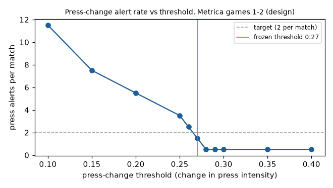

# Design decisions

Short architecture decision records (ADRs): context, decision, consequence.
Every number here comes from a script in `eval/`; the script is named next to it.

## ADR-001: Drop out-of-bounds rows at ingest; keep the 5 m schema margin

**Context.** `schema.validate_frames` rejects positions more than 5 m outside
the pitch lines. Provider data occasionally records real positions beyond that
(the ball behind the goal after a shot, players past the line). In Metrica games
1-3 this is 9 / 75 / 3 rows out of about 3.2 M per game; in SkillCorner it is
tens to a few hundred rows per match.

**Decision.** Keep the margin at 5 m and drop the offending rows at ingest.
Counts are recorded per match, split into ball and player rows, in
`data/processed/<source>/<match>_ingest.json`, and printed by `regista ingest`.

**Consequence.** The margin stays a meaningful filter for Phase 3, where
off-pitch detections (spectators, staff, reflections) must be rejected. The
cost is a handful of lost rows per match, which is disclosed rather than hidden.

## ADR-002: Attacking direction from goalkeepers, not kick-off positions

**Context.** Canonical frames require the home team to attack +x in every
period. The first implementation read each team's median x at kick-off. On
SkillCorner broadcast tracking this failed for match 1925299: at kick-off some
off-camera players are extrapolated across the halfway line, and the home
median was 0.96 m, too close to call.

**Decision.** Per period, take each team's deepest regular player (appearing in
at least half the frames) as its goalkeeper, and use the sign of their mean x.
Ingest raises if the two goalkeepers are not on opposite sides at least 20 m
from halfway.

**Consequence.** All 20 SkillCorner open matches and all 3 Metrica games ingest,
and Metrica's flips are unchanged from the kick-off method. Side agreement with
SkillCorner's listed positions is at least 0.670 in every half (median 0.820),
with no half near zero, so no half is flipped (`eval/formations_eval.py`).

## ADR-003: Pass detector v2 (per-match kick-moment radius), frozen before evaluation

**Context.** v1 owns the ball to the nearest player within a fixed radius tuned
on Metrica games 1-2 (0.5 m). On held-out game 3, scored against the event
labels as published, it reached F1 0.801 against 0.914 on training. The
failure analysis showed game 3 apparently recording the ball further from the
passer at release: more than 0.5 m in 10.0% of labelled releases, against
2.5-3.3% in games 1-2.

**Decision.** v2 derives the ownership radius per match from unlabelled
tracking: the 0.95 quantile of ball-to-nearest-player distance just before each
kick (ball speed crossing 3 m/s upwards and reaching 7 m/s within 0.4 s). A
release gate requires the ball to accelerate away from the passer, and the pass
starts at that frame. A first idea (a quantile of distances in slow-ball frames)
was rejected on training data alone: it gave 0.91 m for game 1 and 0.068 m for
game 2. v2 was tuned on games 1-2 (train F1 0.898), committed with its
parameters frozen (commit `8ce2eb6`), and only then evaluated on game 3.

**Amendment (after ADR-005).** The motivating evidence was mostly a data error.
Game 3's event file swaps two players in the second half (ADR-005); with the
swap corrected, releases with the ball more than 0.5 m from the passer fall
from 10.0% to 4.2%, close to games 1-2. v1 and v2 were not changed or re-tuned.
On corrected labels, game 3 F1 is 0.908 for v1 and 0.914 for v2 (0.801 and
0.809 on the published labels); both are in line with their training scores.

**Consequence.** v1 did not have a real transfer problem; the gap came from the
labels. v2 remains the default because it is frozen, scores marginally higher
on game 3, and its per-match radius needs no hand-set value for new data
sources. Its advantage over v1 is small and may be within noise. Both versions
stay reproducible (`eval/pass_detection.py --version v1|v2`, which prints
scores on both label sets; parameters in `eval/params_phase1.json`). Lesson:
check label integrity before diagnosing a model.

## ADR-004: Template labels are noisy at 5-minute windows; role groups and sides are the output

**Context.** Formations are detected per team, phase, and 5-minute window by
matching the 10 outfield players' mean shape to seven templates. There is no
formation ground truth, so stability is measured without labels, and roles are
checked against SkillCorner's listed positions on all 20 open matches
(16,580 player-windows; `eval/formations_eval.py`). Every method below is
scored on the same player-windows. Confidence intervals come from resampling
matches (2,000 resamples), since windows within a match are not independent.

- **Groups (DEF / MID / FWD): templates about tie a depth-rank baseline** (4
  deepest DEF, next 4 MID, 2 highest FWD). Strict agreement is 0.731 vs 0.724,
  a difference of +0.007 (95% CI -0.006 to +0.020); with wingers allowed as MID
  or FWD it is 0.868 vs 0.855, +0.013 (CI +0.001 to +0.026). Out of possession
  the baseline is slightly ahead.
- **Templates add value on midfield roles and sides.** For players listed as
  midfielders, templates agree 0.889 vs 0.764 for depth rank, +0.125 (CI +0.104
  to +0.148); depth rank is better for listed forwards (0.537 vs 0.450 strict).
  Template sides (left / centre / right) agree 0.819 vs 0.685 for splitting the
  width into thirds, +0.133 (CI +0.106 to +0.160).
- **Exact labels are unstable.** The template label repeats in consecutive
  windows only 26-63% of the time per Metrica team and phase (median 0.50 on
  SkillCorner). The back-line count holds better: median 0.684 in possession
  and 0.800 out of possession on SkillCorner. Players keep their position group
  in 86-100% of windows (Metrica medians) but their exact role in only 40-76%.

**Decision.** Treat role groups and sides as the trusted output. Show template
labels only with their margin to the runner-up, the primary ambiguity signal.
Keep `relative_margin` (margin divided by the runner-up cost) as a secondary
number; it is not a probability and must never be presented as one.

**Consequence.** For DEF / MID / FWD alone, depth ranking is as good and far
simpler; the templates earn their place through sides and midfield structure.
Anything downstream that needs a formation works from persistent group-level
structure, not a single window's label.

### Phase 2 note: formation-change alerts

Alerts must be driven by persistent group-level changes, such as the back line
going from four to five, held over consecutive windows. They must not be driven
by raw template flips: the exact label changes in about half of consecutive
windows (label stability median 0.50 on SkillCorner). Back-line alerts use
out-of-possession windows only, where the back-line count is stable in 0.800 of
consecutive windows against 0.684 in possession. An alert on every template flip
would be mostly noise.

## ADR-005: Correct a player-id swap in Metrica game 3 events; report both label sets

**Context.** Diagnosing a weak game-3 home pass network showed player P3580
under-credited by 34 passes and P3573 over-credited by 31. In game 3's second
half, every event credited to P3580 starts exactly on P3573's tracked position
(median distance 0.0 m, 21 m from P3580's own track), and vice versa: 210
events in all. A scan of every player-half in games 1-3 finds no other
mismatch (`eval/_common.py::event_id_mismatches`). The swap caused 127 of v1's
233 game-3 misses and 127 of its 208 false passes.

**Decision.** Fix the ids in the event parser with an explicit, per-period
correction table (`metrica_events.ID_CORRECTIONS`), keeping the published ids
in `from_player_raw` / `to_player_raw`. Report scores on both label sets.
Nothing was re-tuned: games 1-2 have no corrections, so tuning data is
unchanged.

**Consequence.** Game-3 numbers are reported primarily on corrected labels,
with published-label numbers alongside. The correction is justified by the
tracking itself, not by model output, and the mismatch check runs in eval so it
would catch a regression or a new swap.

## ADR-006: Platt scaling, not isotonic, for the displayed pass probability

**Context.** Raw pitch control is underconfident in its upper range, so a
calibrator fitted on games 1-2 (level (a), labelled pass attempts) maps it to a
display probability. On held-out game 3, isotonic regression and Platt scaling
reach nearly the same Brier (0.0518 and 0.0521, against 0.0595 raw;
`eval/phase1.py`). Isotonic is a step function, and it maps 18 game-3 attempts to
exactly 0 even though 7 of them were completed.

**Decision.** Display the Platt-calibrated value (`display: "platt"` in
`eval/calibration_phase1.json`). Raw pitch control stays the model output; the
isotonic results stay in the report for comparison.

**Consequence.** Displayed probabilities are smooth, strictly between 0 and 1,
and come from a two-parameter fit that is less prone to overfitting about 2,000
training attempts. The cost is a Brier difference in the fourth decimal place.
A calibrated value is still an estimate; the reliability diagram in the report
shows how well it holds per bin.

## ADR-007: Pressing thresholds fixed a priori, after StatsBomb's pressure definition

**Context.** Pressing has no ground truth in the open data, so thresholds cannot
be validated and must not be tuned.

**Decision.** A carrier (the frame-level ball owner) is **under pressure** when
an opponent is within 5 yd (4.572 m), following StatsBomb's pressure event,
which "is triggered when a player is within a five-yard radius of an opponent in
possession" (Will Morgan, "How StatsBomb Data Helps Measure Counter-Pressing",
StatsBomb, 20 May 2018,
<https://blogarchive.statsbomb.com/articles/soccer/how-statsbomb-data-helps-measure-counter-pressing/>).
A secondary **tight pressure** metric uses 2 m. Defenders are counted within
4.572 m. Press intensity per window is the share of opponent-carrier frames under
pressure, overall and by pitch third from the pressing team's point of view.
These values were set before looking at any data and are not tuned.

**Consequence.** The metric is simple and explainable, but it is a fixed
radius. StatsBomb's radius "varies as errors by the opponent would prove more
costly, with a maximum range of ten-yards", so pressure near the defending
team's goal (and on goalkeepers) is undercounted here. It ignores velocities and
cover shadows. As a sanity check only, per-window press intensity correlates
with CHALLENGE + RECOVERY on Metrica games 1-3: pooled Spearman 0.296 over 119
windows for raw counts, and 0.517 when counts are normalised per minute of
opponent possession (0.667, 0.542, 0.301 for games 1, 2, 3;
`eval/pressing_sanity.py`). That is not an accuracy figure. Future work: Bekkers (2025), "Pressing Intensity: An Intuitive Measure
for Pressing in Soccer" (arXiv:2501.04712), which models time-to-intercept with
velocities and reaction times, would replace the fixed radius.

## ADR-008: Causal streaming detectors with frozen thresholds

**Context.** Alerts in the viewer and the agent must be "live": a detector may
use only data up to the current time. Thresholds must come from the design games
(Metrica 1-2) and hit a readable rate of about 4-8 alerts per match.

**Decision.**
- **Causal windows.** `moments/engine.py` walks each period in 1-minute chunks.
  At each chunk end it has seen only earlier rows: kinematics are recomputed per
  chunk with 1 s of past context, and the ball owner uses a radius estimated
  from the kick onsets seen so far (the frozen v1 radius, 0.5 m, is the prior
  until 30 onsets). Features cover the trailing 5 minutes. Windows never contain
  frames from two periods. Tests check that output up to any time is identical
  with or without later data.
- **Persistence in minutes.** On rolling windows (5-minute windows, 1-minute
  steps) the out-of-possession back line is unchanged from one step to the next
  93.6% of the time, but a third of its runs last 2 minutes or less
  (`eval/rolling_stability.py`). A change must hold for 3 minutes within a
  period. The reference state carries over half-time.
- **Coverage after a restart.** A window can trigger only once it holds at least
  4 minutes of in-period data. N was set on games 1-2, without re-tuning the
  thresholds, as the smallest coverage whose windows are no noisier than full
  windows (median step-to-step change in press intensity and line height, and
  back-line flip rate, each within 10% of the full-window values); only 12
  windows had 4 minutes of coverage, so the evidence for 4 over 5 is thin.
- **Thresholds** (`eval/tune_moments.py`, games 1-2): back-line change needs a
  template margin of at least 0.055, press change 0.27, line-height shift 14 m.
  Each was chosen for about 2 alerts per match per type. After an alert a
  detector is refractory for one window length, so one transition gives one
  alert.
- **Press-threshold sensitivity** (games 1-2, alerts per match):
  0.10 -> 11.5, 0.15 -> 7.5, 0.20 -> 5.5, 0.25 -> 3.5, 0.26 -> 2.5,
  0.27 -> 1.5, 0.28 -> 0.5, 0.30 -> 0.5, 0.40 -> 0.5. The frozen value sits just
  before a cliff: small shifts in the data can halve or double the press alerts.

  

**Consequence.**
- **Latency.** Measured on synthetic matches with a known change time, alerts
  arrive 6 (back line), 4 (press), and 5 (line height) minutes after the change,
  with the start estimated within 1.5 minutes (`eval/synthetic_latency.py`).
  On real matches there is no known onset: "emit minus estimated start" is
  about 4.5 minutes by construction and says nothing about accuracy.
- **Rates.** 7 and 5 alerts on the design games; 2 on held-out game 3; a median
  of 10 (range 4-17) on the 20 SkillCorner matches, with 4 matches above the
  reporting threshold of 12 (every alert is kept; the viewer ranks by severity).
  Line-height shifts dominate on SkillCorner: its out-of-possession line height
  moves about 38% more over 5 minutes than Metrica's (median 9.6 m vs 7.0 m).
  Broadcast extrapolation does not explain this: only 57% of out-of-possession
  player positions are detected, but the 5-minute line change is unrelated to the
  detected share (Spearman -0.011, `eval/skillcorner_detection.py`). The cause is
  open; thresholds were not changed.
- **One re-run of the held-out matches.** The coverage rule and the stoppage-time
  clock (45+m:ss) were added after the first held-out run, which showed a
  first-half stoppage alert as "47:00". Game 3 and the SkillCorner matches were
  re-run once with the thresholds unchanged; the numbers above are from that
  re-run.
