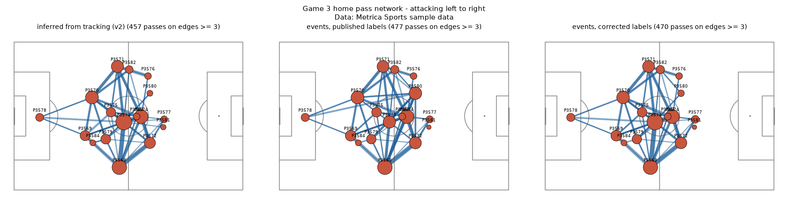
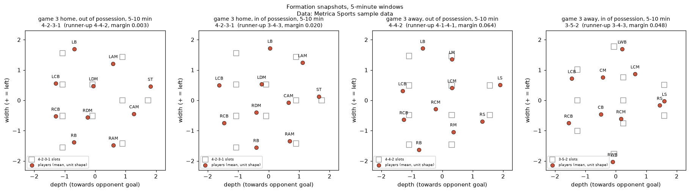
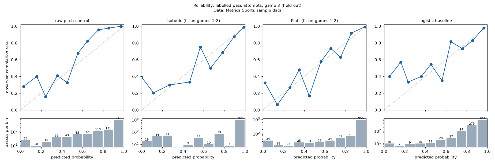
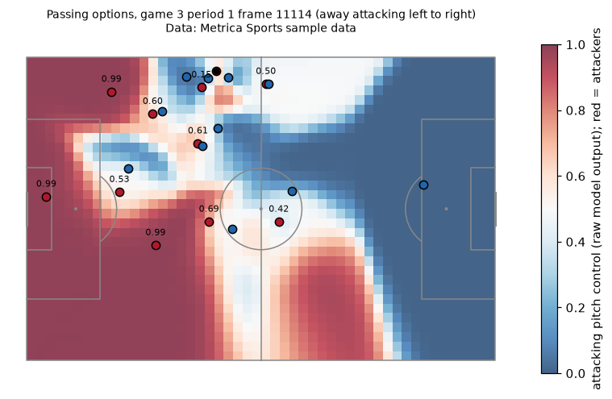

# Regista Phase 1 report

Generated by `eval/phase1.py` on 2026-09-27. Every number below is computed by that script; none is typed by hand.

## TL;DR

- **Label error found and corrected.** Metrica game 3's event file swaps players
  P3573 and P3580 in the second half: all 210 of their events start
  on the other player's tracked position (median 0.0 m).
  No other player-half in games 1-3 is mismatched. With the published labels, pass
  detection on held-out game 3 scores F1 0.801 (v1) / 0.809 (v2); with
  corrected labels, 0.908 / 0.914, in line with training
  (0.914 / 0.898). The swap
  alone caused 127 of v1's 233 misses. Both label sets are reported.
- **Formation templates about tie a depth-rank baseline on position groups.** Against
  SkillCorner's listed positions (20 matches), strict group agreement is
  0.731 vs 0.724
  (difference +0.007, 95% CI -0.006 to +0.020).
  Templates add value on sides (0.819 vs
  0.685 for width thirds, +0.133, CI
  +0.106 to +0.160) and on midfielders (+0.125,
  CI +0.104 to +0.148). Exact template labels are noisy at
  5 minutes (label stability median 0.50); role groups and sides are the
  trusted output.
- **Pitch control beats a logistic baseline; post-hoc calibration improves it further.** At
  labelled pass attempts in game 3 (n = 1253), raw pitch control has Brier
  0.0595 (skill vs base rate 0.384) against
  0.0785 (0.187) for logistic regression on pass length and
  nearest-defender distance; the paired difference is [-0.0279, -0.0100].
  Calibrators fitted on games 1-2 lower Brier to 0.0518 (isotonic) and
  0.0521 (Platt). Pitch control beats the baseline under all 3 failed-pass rules tested.
- **Known limitations.** Failed-pass targets are interception points, which pushes pitch
  control low for failures (mean 0.395 vs
  0.881 for completed passes); options for teammates who were
  not passed to cannot be validated; one held-out game; Metrica has no formation labels; v2
  was designed after the game-3 failure analysis, which turned out to be mostly the
  label swap. Full list below.

## Data

| Dataset | Use | Terms |
|---|---|---|
| Metrica Sports sample games 1-3 (tracking + events) | Pass detection (tune on 1-2, test on 3), formations, shape, networks, pitch control | Acknowledge Metrica Sports |
| SkillCorner open data, 20 matches (broadcast tracking) | Role validation against listed positions | MIT, credit SkillCorner |

Canonical frames: metres on 105 x 68, centre origin, home attacking +x in every period
(direction inferred from goalkeepers). SkillCorner pitches are rescaled from their real size.
Rows more than 5 m outside the lines are dropped at ingest and counted:

| source      |     rows |   oob_ball_rows_dropped |   oob_player_rows_dropped |
|:------------|---------:|------------------------:|--------------------------:|
| metrica     |  9727188 |                       9 |                        78 |
| skillcorner | 20210740 |                    1576 |                      1533 |

Per match:

| source      |   match |   fps |    rows |   oob_ball_rows_dropped |   oob_player_rows_dropped |   flipped_periods |
|:------------|--------:|------:|--------:|------------------------:|--------------------------:|------------------:|
| metrica     |       1 |    25 | 3278380 |                       9 |                         0 |                 2 |
| metrica     |       2 |    25 | 3188633 |                       0 |                        75 |                 1 |
| metrica     |       3 |    25 | 3260175 |                       0 |                         3 |                 1 |
| skillcorner | 1874553 |    10 | 1017464 |                     125 |                        23 |                 2 |
| skillcorner | 1886347 |    10 |  999263 |                     230 |                        41 |                 1 |
| skillcorner | 1899585 |    10 |  935615 |                      37 |                        11 |                 1 |
| skillcorner | 1925299 |    10 | 1102357 |                     158 |                       151 |                 1 |
| skillcorner | 1927964 |    10 | 1029282 |                     151 |                        24 |                 2 |
| skillcorner | 1953632 |    10 | 1009898 |                      72 |                         6 |                 2 |
| skillcorner | 1959846 |    10 |  982709 |                      86 |                       202 |                 2 |
| skillcorner | 1986691 |    10 |  990659 |                      31 |                        58 |                 1 |
| skillcorner | 1996435 |    10 | 1001063 |                     130 |                        20 |                 2 |
| skillcorner | 1996436 |    10 |  990508 |                      10 |                         0 |                 1 |
| skillcorner | 2006229 |    10 | 1015821 |                      28 |                        84 |                 1 |
| skillcorner | 2006363 |    10 | 1019770 |                      65 |                       146 |                 2 |
| skillcorner | 2007448 |    10 | 1018339 |                      83 |                        87 |                 1 |
| skillcorner | 2007721 |    10 | 1064639 |                      58 |                       134 |                 1 |
| skillcorner | 2010085 |    10 | 1046972 |                       0 |                        11 |                 1 |
| skillcorner | 2011166 |    10 |  897199 |                      38 |                       108 |                 1 |
| skillcorner | 2013725 |    10 | 1034809 |                       7 |                         0 |                 2 |
| skillcorner | 2015213 |    10 | 1116075 |                     125 |                       266 |                 2 |
| skillcorner | 2016236 |    10 | 1009262 |                      23 |                        24 |                 2 |
| skillcorner | 2017461 |    10 |  929036 |                     119 |                       137 |                 2 |

### Event label integrity

For every labelled event, the tracked player nearest its start position should be the
credited player. Mismatched player-halves with the ids as published:

|   period | credited   |   events | nearest_player   |   share |   median_dist_to_nearest |
|---------:|:-----------|---------:|:-----------------|--------:|-------------------------:|
|        2 | P3573      |       71 | P3580            |       1 |                        0 |
|        2 | P3580      |      139 | P3573            |       1 |                        0 |

Games 1, 2: 0 mismatches.
After the correction in `metrica_events.ID_CORRECTIONS`: 0 mismatches.
Tuning data (games 1-2) needed no correction, so no parameter depended on it.

## Pass detection

Owner = nearest player within a radius, gated by ball speed; a pass is an owner change
between teammates, matched to Metrica PASS events with a tolerance of
5 frames. v1 uses a fixed radius; v2 derives the radius per
match from unlabelled kick onsets and gates passes on the ball accelerating away. Both were
tuned on games 1-2 only (train F1 v1 0.914, v2
0.898); v2 was frozen before its game-3 evaluation and
was designed after the v1 failure analysis on published labels.

| detector   | labels    |   precision |   recall |    f1 |   radius_m |   predicted |   labelled |
|:-----------|:----------|------------:|---------:|------:|-----------:|------------:|-----------:|
| v1         | published |       0.81  |    0.792 | 0.801 |      0.5   |        1096 |       1121 |
| v1         | corrected |       0.919 |    0.898 | 0.908 |      0.5   |        1096 |       1121 |
| v2         | published |       0.821 |    0.798 | 0.809 |      0.529 |        1089 |       1121 |
| v2         | corrected |       0.927 |    0.901 | 0.914 |      0.529 |        1089 |       1121 |

Share of labelled releases with the ball more than 0.5 m from the passer (the evidence that
motivated v2; with published labels game 3 looked different, with corrected labels it
does not):

|   game |   published labels |   corrected labels |
|-------:|-------------------:|-------------------:|
|      1 |              0.033 |              0.033 |
|      2 |              0.025 |              0.025 |
|      3 |              0.1   |              0.042 |

Remaining failure modes (v2, corrected labels):

| type          | reason                                                                        |   count | examples                                       |
|:--------------|:------------------------------------------------------------------------------|--------:|:-----------------------------------------------|
| missed (FN)   | possession chain broken (ball near an opponent or a brief touch in between)   |      63 | P1 361-377, P1 1125-1149, P1 1149-1180         |
| spurious (FP) | near a labelled BALL LOST event, not a PASS                                   |      26 | P1 2365-2477, P1 10018-10091, P1 12495-12537   |
| missed (FN)   | passer never within radius before release                                     |      24 | P1 2072-2121, P1 3543-3568, P1 6486-6514       |
| spurious (FP) | near a labelled CHALLENGE event, not a PASS                                   |      14 | P1 3627-3661, P1 16098-16101, P1 33556-33558   |
| spurious (FP) | near a labelled RECOVERY event, not a PASS                                    |      14 | P1 1233-1314, P1 8212-8294, P1 8295-8324       |
| spurious (FP) | no labelled event within 1 s (dribble near a teammate or unlabelled touch)    |      13 | P1 16939-16978, P1 32572-32599, P1 42199-42200 |
| missed (FN)   | wrong passer or receiver (a third player came within radius)                  |      12 | P1 36746-36818, P1 42198-42245, P1 53710-53732 |
| spurious (FP) | near a labelled CARRY event, not a PASS                                       |       7 | P1 8532-8547, P1 36747-36774, P1 49685-49697   |
| missed (FN)   | receiver never within radius (one-touch lay-off, deflection or loose receipt) |       6 | P1 11258-11288, P1 18703-18740, P1 26262-26337 |
| missed (FN)   | right players, release time off by more than the tolerance                    |       6 | P1 8525-8547, P1 32616-32687, P1 51669-51714   |
| spurious (FP) | near a labelled SET PIECE event, not a PASS                                   |       3 | P1 8131-8210, P1 53444-53508, P2 103434-103468 |
| spurious (FP) | near a labelled BALL OUT event, not a PASS                                    |       1 | P1 23718-23726                                 |
| spurious (FP) | near a labelled SHOT event, not a PASS                                        |       1 | P2 107334-107350                               |

## Team shape (median of 5-minute medians)

|                      |   line_height |   length |   width |   hull_area |   centroid_x |   centroid_y |
|:---------------------|--------------:|---------:|--------:|------------:|-------------:|-------------:|
| ('1', 'away', 'in')  |          40   |     33.5 |    47.5 |      1120.4 |          5.2 |         -1.2 |
| ('1', 'away', 'out') |          38.4 |     31   |    38.6 |       798.5 |         -2   |         -0.2 |
| ('1', 'home', 'in')  |          33.9 |     33.6 |    46.9 |      1139.5 |         -3.2 |          1   |
| ('1', 'home', 'out') |          29.5 |     30.6 |    35.7 |       762.6 |        -12.3 |          0.6 |
| ('2', 'away', 'in')  |          40.5 |     32.8 |    50   |      1117.5 |          6.3 |          0.7 |
| ('2', 'away', 'out') |          29.5 |     29.3 |    35.6 |       706.6 |        -13.1 |          0.9 |
| ('2', 'home', 'in')  |          40.3 |     34.6 |    45.7 |      1001.2 |          5   |         -1   |
| ('2', 'home', 'out') |          29.3 |     29.2 |    36.5 |       704.8 |        -11.7 |         -0.8 |
| ('3', 'away', 'in')  |          33.9 |     35.6 |    52.1 |      1229.4 |         -0.8 |          1.8 |
| ('3', 'away', 'out') |          33.4 |     31   |    38.2 |       750.1 |         -7.4 |          1.3 |
| ('3', 'home', 'in')  |          34.5 |     36.4 |    51.3 |      1267.7 |          1.5 |         -1.3 |
| ('3', 'home', 'out') |          35.3 |     32.9 |    37.2 |       820.3 |         -4.5 |         -2.3 |

## Pass networks

Inferred networks (from tracking) vs labelled-event networks on game 3, over the union
of directed player pairs:

| labels    | version   | team   |   edges_a |   edges_b |   pearson |   spearman |   weighted_jaccard |
|:----------|:----------|:-------|----------:|----------:|----------:|-----------:|-------------------:|
| corrected | v1        | away   |       161 |       170 |     0.952 |      0.927 |              0.86  |
| corrected | v1        | home   |       161 |       160 |     0.983 |      0.939 |              0.908 |
| published | v1        | away   |       161 |       170 |     0.952 |      0.927 |              0.86  |
| published | v1        | home   |       161 |       161 |     0.81  |      0.733 |              0.738 |
| corrected | v2        | away   |       161 |       170 |     0.951 |      0.927 |              0.86  |
| corrected | v2        | home   |       162 |       160 |     0.981 |      0.938 |              0.903 |
| published | v2        | away   |       161 |       170 |     0.951 |      0.927 |              0.86  |
| published | v2        | home   |       162 |       161 |     0.81  |      0.723 |              0.735 |

With published labels the home network agreed at Pearson 0.810;
with corrected labels, 0.983. Largest remaining home edge
residuals (v2 minus corrected events):

| from_player   | to_player   |   passes_inferred |   passes_events |   residual |
|:--------------|:------------|------------------:|----------------:|-----------:|
| P3573         | P3579       |                 6 |               8 |         -2 |
| P3572         | P3577       |                 3 |               5 |         -2 |
| P3576         | P3575       |                 2 |               0 |          2 |
| P3571         | P3576       |                12 |              10 |          2 |
| P3580         | P3582       |                 2 |               4 |         -2 |
| P3575         | P3576       |                 0 |               2 |         -2 |



## Formations and roles

Mean centroid-relative shape of the 10 outfield players per team, phase, and 5-minute window,
matched to seven templates by assignment cost. `margin` = runner-up cost minus best cost (the
primary ambiguity signal); `relative_margin` = margin / runner-up cost. Neither is a
probability.

**No formation ground truth exists in Metrica** (anonymised, no labels), so Metrica gets
label-free diagnostics only. Roles are checked against SkillCorner's listed positions (one
position per player per match), on the same player-windows for every method:

|     |   player_windows |   group_template_strict |   group_template_lenient |   group_depth_strict |   group_depth_lenient |   side_template |   side_thirds |
|:----|-----------------:|------------------------:|-------------------------:|---------------------:|----------------------:|----------------:|--------------:|
| all |            16580 |                   0.731 |                    0.868 |                0.724 |                 0.855 |           0.819 |         0.685 |
| in  |             8290 |                   0.713 |                    0.844 |                0.687 |                 0.812 |           0.817 |         0.686 |
| out |             8290 |                   0.748 |                    0.892 |                0.761 |                 0.898 |           0.82  |         0.684 |

Match-level bootstrap (2000 resamples), difference and 95% CI:

|                                     |   difference |   ci_low |   ci_high |
|:------------------------------------|-------------:|---------:|----------:|
| group strict: template - depth      |        0.007 |   -0.006 |     0.02  |
| group lenient: template - depth     |        0.013 |    0.001 |     0.026 |
| listed MID strict: template - depth |        0.125 |    0.104 |     0.148 |
| side: template - thirds             |        0.133 |    0.106 |     0.16  |

Stability on SkillCorner (share of consecutive windows unchanged), median by phase:

|                 |    in |   out |
|:----------------|------:|------:|
| exact label     | 0.5   |   0.5 |
| back-line count | 0.684 |   0.8 |

Metrica, label-free: median margin 0.052; label and back-line
stability per team and phase:

|   match_id | team   | phase   |   stability |   stability_back_line |
|-----------:|:-------|:--------|------------:|----------------------:|
|          1 | away   | in      |        0.26 |                  0.63 |
|          1 | away   | out     |        0.37 |                  0.37 |
|          1 | home   | in      |        0.53 |                  1    |
|          1 | home   | out     |        0.53 |                  0.89 |
|          2 | away   | in      |        0.53 |                  0.84 |
|          2 | away   | out     |        0.5  |                  0.72 |
|          2 | home   | in      |        0.28 |                  0.44 |
|          2 | home   | out     |        0.63 |                  1    |
|          3 | away   | in      |        0.58 |                  0.74 |
|          3 | away   | out     |        0.37 |                  0.63 |
|          3 | home   | in      |        0.37 |                  0.79 |
|          3 | home   | out     |        0.58 |                  0.89 |

Away 3-5-2 vs 5-3-2: 9 of 36 away 3-5-2 windows are
closer to 5-3-2 than the all-window median margin, and 7 of
64 away label changes are between the two. The margin is narrow in a minority of windows, not in most.

Side agreement by half: 0.850 (first) vs 0.789 (second) for all
players; 0.863 vs 0.803 for
players tracked in at least 95% of both halves. No half falls
below 0.5 (minimum 0.670). **Open observation:** the
second-half dip persists for full-match players, but they can still shift roles when
teammates are substituted, so substitutions are not ruled out.



## Passing options (pitch control)

Spearman pitch control with LaurieOnTracking's published parameters (nothing fitted),
evaluated only at target points. Baselines fitted on games 1-2: the completion rate (for the
Brier skill score) and logistic regression on pass length and nearest-defender distance to
the target. Uncertainty: block bootstrap over 1-minute blocks.

### (a) Labelled pass attempts (headline)

Completed = PASS; failed = BALL LOST with subtype containing INTERCEPTION, CROSS, DEEP BALL, THROUGH BALL, GOAL KICK.
Train 2050 attempts (completion 0.860), test 1253
(completion 0.893).

| model                  |   brier |   brier_ci_low |   brier_ci_high |   skill_vs_base_rate |   skill_ci_low |   skill_ci_high | brier_minus_logistic_ci   | brier_minus_base_rate_ci   |
|:-----------------------|--------:|---------------:|----------------:|---------------------:|---------------:|----------------:|:--------------------------|:---------------------------|
| pitch_control          |  0.0595 |         0.0514 |          0.0677 |               0.384  |         0.3005 |          0.4568 | [-0.0279, -0.0100]        | [-0.0488, -0.0261]         |
| pitch_control_isotonic |  0.0518 |         0.042  |          0.0619 |               0.4638 |         0.3793 |          0.5449 | [-0.0364, -0.0172]        | [-0.0564, -0.0340]         |
| pitch_control_platt    |  0.0521 |         0.0426 |          0.0619 |               0.4606 |         0.3804 |          0.5353 | [-0.0356, -0.0172]        | [-0.0555, -0.0341]         |
| logistic               |  0.0785 |         0.0673 |          0.0895 |               0.1872 |         0.116  |          0.2563 | nan                       | nan                        |
| base_rate              |  0.0966 |         0.0831 |          0.1104 |               0      |         0      |          0      | nan                       | nan                        |

Raw pitch control stays the model output; the isotonic calibrator (fitted on games 1-2,
`eval/calibration_phase1.json`) is the display probability for later phases. Note: isotonic
maps 18 game-3 attempts to exactly 0, of which
7 were completed; Platt scaling avoids hard zeros at nearly the
same Brier.



Failed-pass rule sensitivity (baselines refitted on games 1-2 under each rule):

| rule              | definition                                                                                                         |   failed (train) |   failed (test) |   Brier pitch control |   Brier logistic | PC - logistic, 95% CI   |
|:------------------|:-------------------------------------------------------------------------------------------------------------------|-----------------:|----------------:|----------------------:|-----------------:|:------------------------|
| default           | BALL LOST with a pass-attempt subtype (INTERCEPTION, CROSS, DEEP BALL, THROUGH BALL, GOAL KICK)                    |              287 |             134 |                0.0595 |           0.0785 | [-0.0279, -0.0100]      |
| interception_only | BALL LOST with an INTERCEPTION subtype                                                                             |              283 |             126 |                0.0593 |           0.0778 | [-0.0282, -0.0094]      |
| plus_ball_out     | default, plus BALL LOST (not a non-pass loss) followed directly by BALL OUT within 3 s or ending outside the lines |              288 |             134 |                0.0595 |           0.0785 | [-0.0279, -0.0100]      |

The "plus ball out" rule adds 1 (game 1), 0 (game 2), 0 (game 3)
failed passes: Metrica logs BALL OUT after the recovering team's event, so almost no BALL
LOST is directly followed by it.

### (b) End to end, v2-inferred passes

Completed = v2 pass; failed = v2 turnover with a ball release. Composition on game 3,
by the labelled event nearest each release (labels describe level (b) only):

| failure_category        |   attempts |   share |
|:------------------------|-----------:|--------:|
| completed               |       1089 |   0.756 |
| labelled failed pass    |        104 |   0.072 |
| other or unmatched      |         70 |   0.049 |
| tackle or lost dribble  |         64 |   0.044 |
| labelled completed pass |         57 |   0.04  |
| unspecified ball loss   |         56 |   0.039 |

All inferred attempts (completion 0.756):

| model         |   brier |   brier_ci_low |   brier_ci_high |   skill_vs_base_rate |   skill_ci_low |   skill_ci_high |
|:--------------|--------:|---------------:|----------------:|---------------------:|---------------:|----------------:|
| pitch_control |  0.0672 |         0.0593 |          0.076  |               0.6357 |         0.5985 |          0.6708 |
| logistic      |  0.103  |         0.0924 |          0.1142 |               0.4411 |         0.3913 |          0.4889 |
| base_rate     |  0.1844 |         0.1732 |          0.1959 |               0      |         0      |          0      |

Without tackles and lost dribbles (completion 0.791):

| model         |   brier |   brier_ci_low |   brier_ci_high |   skill_vs_base_rate |   skill_ci_low |   skill_ci_high |
|:--------------|--------:|---------------:|----------------:|---------------------:|---------------:|----------------:|
| pitch_control |  0.0627 |         0.0549 |          0.0713 |               0.6203 |         0.5755 |          0.6593 |
| logistic      |  0.0956 |         0.085  |          0.1067 |               0.4213 |         0.3608 |          0.4789 |
| base_rate     |  0.1652 |         0.1539 |          0.1769 |               0      |         0      |          0      |

Level (b) targets are ball positions at receipt, next to whoever got the ball, so it is an
easier task than scoring intended targets, and part of its "failures" are detector errors
(57 attempts match a labelled completed pass).



## Known limitations

- One held-out game; games 1-2 for all tuning and fitting. Game 3 comes in a different
  provider format (FIFA EPTS) from games 1-2.
- Game-3 event ids were corrected (P3573/P3580, second half); published-label results are
  shown alongside.
- v2 was designed after seeing v1's game-3 failures, which were mostly the label swap;
  its gain over v1 is small and may be within noise.
- Failed-pass end locations are interception points, not intended targets: pitch control is
  biased low for failures, which flatters its discrimination.
- Passing-option values for teammates who were not passed to cannot be validated.
- Pitch-control parameters are published defaults; raw values are underconfident in the
  upper range (see reliability diagram) and are model outputs, not calibrated probabilities.
- Metrica has no formation or position labels; SkillCorner lists one position per player
  per match, and wingers are ambiguous between MID and FWD.
- SkillCorner tracking comes from broadcast video; off-camera players are extrapolated by the
  provider.
- Rows beyond 5 m outside the lines are dropped (counts above).

## Reproduce

```
uv sync --group dev
uv run python eval/phase1.py
```

Downloads the open data on first run. Parameters: `eval/params_phase1.json` (re-derived and
checked by this script); calibrators: `eval/calibration_phase1.json`.

## Credits

Tracking and event data: Metrica Sports sample data
(https://github.com/metrica-sports/sample-data). Broadcast tracking: SkillCorner open data
(https://github.com/SkillCorner/opendata, MIT). Pitch control adapted from
LaurieOnTracking (MIT). Loading via kloppy (BSD-3-Clause); plots with mplsoccer (MIT). See
`THIRD_PARTY_NOTICES.md`.
